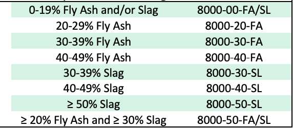

# Industry Wide Ready Mix Concrete Baseline Data 

- Source: [National Ready Mix Concrete Assoc](https://www.nrmca.org/wp-content/uploads/NRMCA_EPDV3.2_2023.pdf)
- Referenced by [Kittelson & Associates](https://www.kittelson.com/ideas/paving-the-way-for-low-carbon-concrete/)
- Earlier version mentioned in Meg Calkins' *Details and Materials for Resilient Sites* (Ch. 14 - Concrete Materials & Products, p. 272)

## About the data 
- Units for GWP: kg-co2-eq / m3
- Each GWP number represents a different alteration from a standard mix 

  - #TODO: is this up to 50% of the cement, or 50% of the concrete mix? 
- Much more data is available -> energy use might also be interesting to look at 

#TODO - some checks on data size.. 
